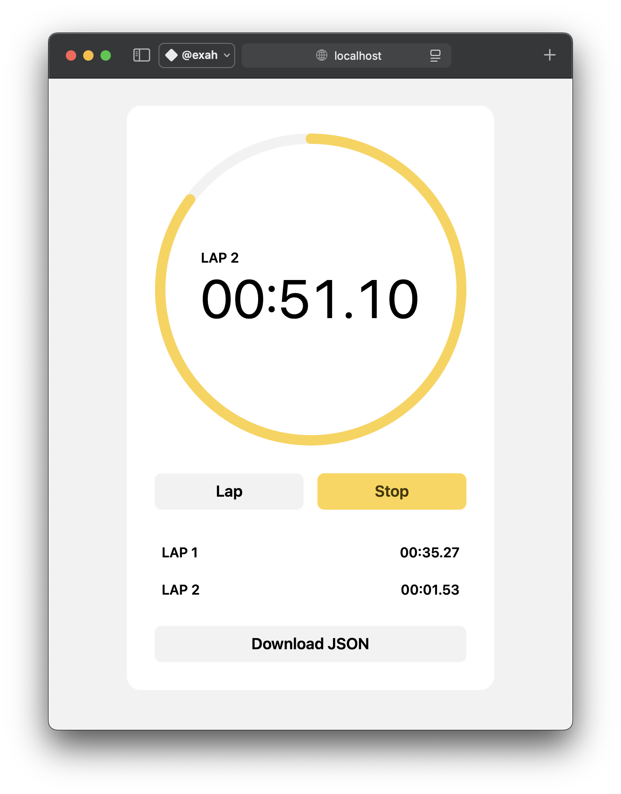

# [⏱️ Stopwatch](https://exah-stopwatch.vercel.app/)

> A tiny stopwatch web app



- [x] Full-featured stopwatch
- [x] Record laps and export data as JSON
- [x] Built with [Vite](https://vite.dev), [React](https://react.dev), and strongly typed [TypeScript](https://www.typescriptlang.org)
- [x] Styled with [vanilla-extract](https://vanilla-extract.style)
- [x] Tested using [Vitest](https://vitest.dev) and [Playwright](https://playwright.dev/docs/test-components)

## Requirements

- [`node`](https://nodejs.org/en) v22.19.00+
- [`npm`](https://npmjs.com) v10.9.3+

## Getting started

Install dependencies:

```shell
npm i
```

Start the development server:

```shell
npm start
```

Then follow the Vite instructions in your terminal to open the app.

## Designs

You can find the app designs in Figma [here](https://www.figma.com/design/tSsfDRYEyhqgQhlugd6f3V/stopwatch?node-id=0-1&t=ckaNTSwiqAdDcVIv-1).

## Tests

Run unit tests on helpers:

```shell
npm t
```

Run the component test with real browsers:

```shell
npm run test-ct
```

---

MIT © [John Grishin](http://johngrish.in)
